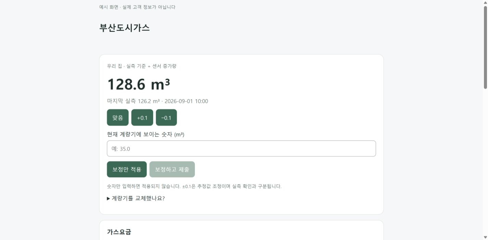

<picture>
  <source media="(prefers-color-scheme: dark)" srcset="brand/dark_logo.png">
  
</picture>

# 부산도시가스를 Home Assistant에서

가스요금을 확인하고, 계량기 숫자를 기록하고, 센서가 있다면 현재 검침값까지 추정해 보세요.

부산도시가스 이용자를 위한 **비공식 Home Assistant 통합**입니다. 별도 카드나 대시보드를 만들지 않아도 전용 화면에서 조회와 보정을 할 수 있습니다.

> **처음 공개하는 버전으로, 사용 후기를 기다리고 있습니다.**
> 요금 조회·검침 추정·보정·접수 상태 조회를 이용할 수 있습니다.
> **부산도시가스로 검침값을 보내는 기능은 아직 사용할 수 없습니다.**
> 필요한 자가검침은 기존처럼 부산도시가스 홈페이지에서 직접 해주세요.

## 이런 일을 할 수 있어요

- 최근 가스요금, 지난 고지서, 사용량과 납기일 확인
- 누적 가스센서를 연결해 현재 검침값과 예상 요금 확인
- 계량기 숫자를 직접 입력하거나 `맞음 / +0.1 / −0.1`로 보정
- Android 휴대폰으로 주간 검침 보정 알림 받기
- 자가검침 가능 기간과 접수 내역 확인

센서가 없어도 요금 조회와 수동 검침 기록을 사용할 수 있습니다. 예상 요금은 실제 청구액과 다를 수 있습니다.

## 화면 미리보기

*실제 통합 화면에 예시 데이터를 넣어 촬영했습니다. 화면의 숫자는 실제 고객 정보가 아닙니다.*

## 설치하기

**Home Assistant 2026.7.4 이상**과 부산도시가스 홈페이지 회원 계정이 필요합니다. 간편조회용 정보가 아닌 회원 아이디·비밀번호를 사용합니다.

HACS가 설정되어 있다면 위 버튼을 누르세요. 처음에는 사용자 지정 저장소로 추가해야 할 수 있습니다. HACS 기본 목록에 등록된 통합은 아닙니다.

1. HACS에 이 저장소를 추가하고 **부산도시가스**를 다운로드합니다.
2. Home Assistant를 재시작합니다.
3. **설정 → 기기 및 서비스 → 통합 추가 → 부산도시가스**에서 로그인합니다.

[처음 설치하는 방법](docs/installation.md) · [검침 보정과 알림 사용법](docs/usage.md) · [문제 해결](docs/troubleshooting.md)

## 사용 후기를 보내주세요

설치가 잘 됐는지, 고지금액이 맞는지, 휴대폰 알림이 도착하는지 알려주세요. 개발 지식은 필요하지 않습니다.

[테스트 참여 안내](docs/testing.md) · [사용 후기·오류 제보](https://github.com/mahlernim/ha-busan-city-gas/issues/new?template=test-report.yml)

**아이디·비밀번호·계약번호·주소·원본 고지서는 공개 게시물에 올리지 마세요.** 화면 사진을 첨부할 때도 개인정보를 가려주세요.

## 알아두세요

- 부산도시가스에서 제공하거나 운영하는 공식 앱이 아닙니다. 홈페이지 변경에 따라 조회가 중단될 수 있습니다.
- 예상 사용량·요금은 참고용입니다. 결제나 가스밸브 제어 기능은 없습니다.
- 알림은 선택 사항이며, 자동 제출 설정을 켜더라도 이 버전에서는 검침값을 전송하지 않습니다.
- 기존 가스센서와 에너지 통계는 그대로 유지합니다.
- [개인정보·권한 안내](docs/privacy.md) · [업데이트 내용](CHANGELOG.md) · [라이선스](LICENSE)

코드로 기여하고 싶다면 [개발 참여 안내](CONTRIBUTING.md)를 참고해 주세요.
