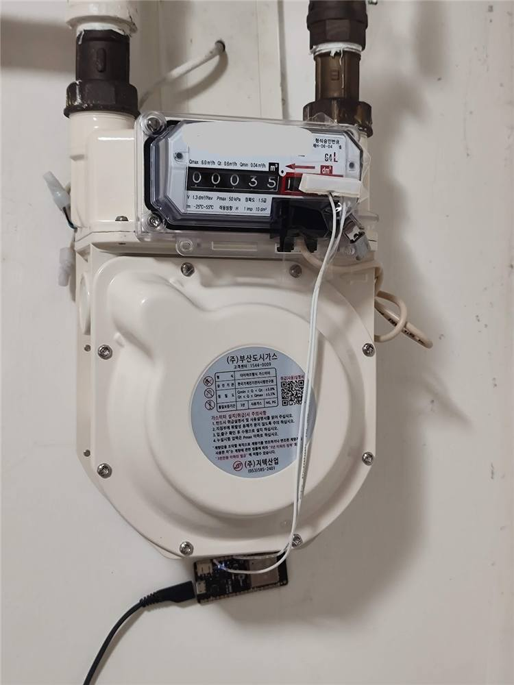

# 센서 없이도 검침값 추정하기

[처음으로](../README.md) · [설치](installation.md) · [보정·제출](usage.md)

별도 하드웨어가 없어도 됩니다. 설치할 때 센서를 비워두고, 계량기에 보이는 전체 숫자를 입력하세요. 입력을 생략하면 같은 계량기의 날짜가 확인된 공식 검침을 기준으로 사용합니다. 사용할 기준이 없으면 숫자 입력을 안내합니다.

계량기를 보고 **맞음** 또는 **보정만 적용**으로 확인하면 현재 숫자를 고칩니다. 7일 이상 간격의 실측 기록이 쌓이면 최근 사용 추세도 반영합니다. 자주 확인한다고 정확도가 보장되지는 않으며, 난방·외출 등 실제 생활 변화와 차이가 날 수 있습니다.

## 무엇을 기준으로 증가하나요?

| 자료 | 사용하는 방법 |
| --- | --- |
| 전년도 사용량 | 작년의 대응 날짜를 포함하는 고지서 사용량을 실제 사용기간 일수로 나눕니다. 윤년 2월 29일은 작년 2월 28일에 대응합니다. |
| 최근 실측 | 최신 실측과 그 이전 28일 안의 가장 오래된 유효 실측을 비교합니다. 간격이 7일 이상이어야 합니다. |
| 두 자료가 모두 있음 | 최신 실측 후 14일까지 50:50으로 섞고, 이후 최근 실측 비중을 줄여 28일째에는 과거 사용량만 사용합니다. |
| 과거 사용량이 없음 | 유효한 최근 실측 속도만 최신 실측 후 14일 이내에 사용합니다. 이후에는 자료 부족으로 표시합니다. |

50:50과 14일·28일은 설명 가능한 초기 기본값이며, 실제 가정에서 최적이라고 검증된 계수가 아닙니다. 2차식이나 추가 통계 라이브러리는 사용하지 않습니다.

실측 한 번은 현재 숫자만 고칩니다. **±0.1 조정, 자동 제출값, 접수 확인값, 모델 예측값은 실측 학습에 넣지 않습니다.** 실제로 사용량이 0인 실측 구간은 유효합니다. 같은 날짜에 다시 입력하면 학습용 관측은 마지막 값으로 대체하며 최근 90일을 보관합니다. 계량기 교체는 별도 기준 재설정으로 처리합니다.

고지서나 모델이 갱신되면 이후 증가 속도에 반영합니다. 단순 새로고침으로 이미 보이던 누적 숫자가 갑자기 바뀌지 않도록 기준점과 계산 구간을 함께 저장합니다. 예정 검침일이 없어도 검침 추정은 계속할 수 있지만, 청구 시작 기준·예정 종료일이 확인되지 않은 요금 계산은 준비 중으로 남습니다.

## 센서가 있는 경우와의 차이

ESPHome 등의 누적 센서를 연결하면 **실측 기준 + 센서 증가량**을 사용합니다. 센서가 고장 났다고 과거 추정으로 자동 전환하지 않습니다. 센서의 최근 14일 평균은 기존과 같이 사용량 0인 날·불완전한 날을 제외한 **사용일 평균**입니다.

아래는 ESP32와 리드 센서로 계량기의 변화를 읽는 설치 참고 사진입니다. 식별정보를 가린 공개용 사본이며 설치 방법·안전성·측정 정확성을 보증하는 자료는 아닙니다. 가스 배관·봉인·계량기 본체를 개조하지 마세요. 이 통합은 ESPHome 펌웨어를 변경하지 않습니다.

## 제출은 별도 선택입니다

최근 실측을 섞더라도 모델 기반 추정입니다. 센서 없이 추정값을 제출하려면 기존의 **과거 사용량 기반 추정값 제출 허용** 옵션이 필요합니다. 업데이트만으로 이 옵션이나 자동 제출을 켜지 않습니다. 실제 숫자를 확인하여 수동 제출하는 절차와는 구분됩니다.
