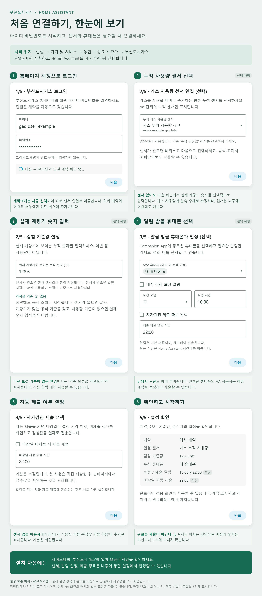

# 설치와 처음 설정

[처음으로](../README.md) · [사용법](usage.md) · [문제 해결](troubleshooting.md)

## 준비물

- Home Assistant 2026.7.4 이상
- 부산도시가스 홈페이지에서 로그인할 수 있는 회원 아이디·비밀번호
- 선택: m³ 단위 누적 가스 사용량 센서, Android용 Home Assistant Companion App

센서나 휴대폰 알림은 나중에 추가해도 됩니다. 처음에는 요금 조회만 사용해도 괜찮습니다.
설치 전에 Home Assistant 백업을 만들어 두는 것을 권장합니다.

## HACS로 설치하기

HACS가 아직 없다면 [HACS 공식 설치 안내](https://www.hacs.xyz/docs/use/)를 먼저 확인해 주세요.

1. Home Assistant에서 **HACS**를 엽니다.
2. 오른쪽 위 메뉴에서 **사용자 지정 저장소(Custom repositories)**를 선택합니다.
3. 저장소 주소에 `https://github.com/mahlernim/ha-busan-city-gas`를 입력하고 종류는 **통합(Integration)**을 선택합니다.
4. **부산도시가스**를 찾아 다운로드합니다.
5. Home Assistant를 재시작합니다.

메뉴 이름은 HACS 버전에 따라 조금 다를 수 있습니다. 다운로드만 하면 설정이 끝나는 것은 아닙니다. 이어서 통합을 추가해 주세요.

## 부산도시가스 계정 연결하기

1. **설정 → 기기 및 서비스 → 통합 추가 → 부산도시가스**를 선택합니다.
2. 부산도시가스 **회원 아이디·비밀번호**를 입력합니다. 고객번호나 쿠키를 따로 찾을 필요는 없습니다.
3. 계약이 여러 개라면 사용할 계약을 선택합니다. 하나라면 다음 단계로 넘어갑니다.
4. 가스센서가 있다면 원본 누적 센서를 선택합니다. 없다면 건너뜁니다.
5. 센서 유무와 관계없이 계량기에 보이는 숫자를 선택적으로 입력합니다. 생략하면 센서 없는 경우 날짜·계량기가 맞는 공식 기준을 찾습니다. 사용할 기준이 없으면 숫자 입력을 안내합니다.
6. 보정 알림을 받을 휴대폰과 일정을 선택하거나 건너뜁니다. 자동 제출은 실제 전송하는 옵션이므로, 처음에는 꺼두고 수동 제출을 확인한 뒤 설정하세요.
7. 요약을 확인하고 완료합니다. 사이드바에 **부산도시가스**가 나타납니다.

처음에는 고지서 이력을 가져오느라 시간이 걸릴 수 있습니다. 화면에 조회 진행 상태가 표시됩니다.
설치를 완료했다고 검침값이 부산도시가스로 제출되지는 않습니다.

*v0.4.0 흐름을 간결하게 재구성한 모의 안내입니다. 입력값은 예시이며 실제 로그인·제출 검증 화면이 아닙니다. 계약이 여러 개인 경우에만 선택 단계가 추가됩니다.*

### 어떤 센서를 선택하나요?

가스 사용량이 누적되는 **m³ 단위 원본 센서**를 선택하세요. 이름만 보고 판단하지 말고 단위와 값의 변화를 확인해 주세요.
매일 또는 매월 0으로 초기화되는 집계 센서, 예상 검침값 센서는 선택하지 않습니다.

### 계량기 숫자는 어떻게 입력하나요?

현재 계량기에 보이는 누적 숫자를 소수점까지 입력합니다. 월 사용량이나 이번 달 요금이 아닙니다.
센서가 있으면 같은 시점의 센서값을 기준으로 이후 증가량을 더합니다. 없으면 실측 시각을 함께 기록하여 [과거 사용량·실측 추세 기반 추정](estimation.md)에 사용합니다.
기존 보정값을 가져오는 선택지가 보이면 값과 확인 시각을 확인한 후 선택하세요.

## HACS 없이 설치하기

1. [최신 배포](https://github.com/mahlernim/ha-busan-city-gas/releases/latest)에서 `busan_city_gas.zip`을 받습니다.
2. 압축을 풀면 `custom_components/busan_city_gas` 폴더가 나옵니다.
3. Home Assistant 설정 폴더의 `custom_components` 아래에 `busan_city_gas` 폴더를 복사합니다.
4. Home Assistant를 재시작하고 위의 계정 연결 과정을 진행합니다.

설정 폴더를 직접 관리하는 방법이 익숙하지 않다면 HACS 설치를 권장합니다.

## 업데이트·삭제

HACS 업데이트를 다운로드한 뒤 Home Assistant를 재시작합니다. 계정을 삭제하고 다시 추가할 필요는 없습니다.
0.3.0에서 0.4.0으로 업데이트하면 기존 계약·엔티티·실측 기준·고지서·제출 이력과 동의 설정을 유지합니다. 기존 표시용 보정 이력을 모두 학습 자료로 복원하지 않고 마지막 실측값·시각만 이전합니다. 이미 발생한 측정 공백은 새 버전에서도 실제 확인 전까지 유지합니다.
0.2.0에서 업데이트했다면 수동 제출을 사용할 수 있습니다. 이전 자동 제출 설정은 실행되지 않으므로 사용하려면 **제출 정책**에서 다시 켜고 저장하세요. 고지서·검침 보정·접수 이력은 유지됩니다.
삭제하려면 먼저 통합을 삭제하고 HACS에서 제거한 뒤 재시작합니다. 기존 원본 가스센서와 에너지 통계는 별도로 유지됩니다.
