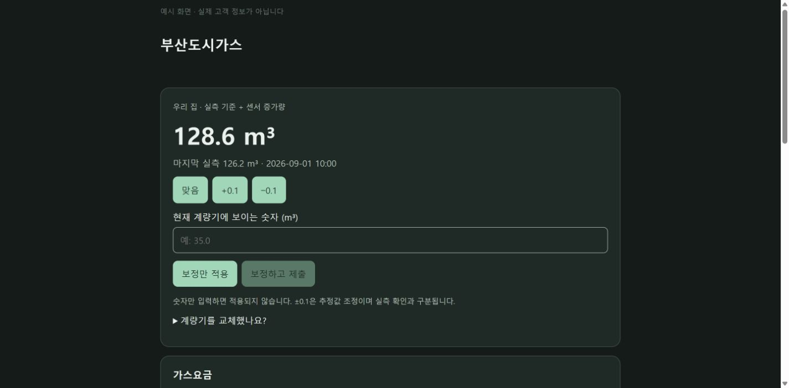

# 검침값 보정과 알림 사용법

[처음으로](../README.md) · [설치](installation.md) · [문제 해결](troubleshooting.md)

## 숫자 세 가지 구분하기

- **검침값**: 계량기에 표시되는 누적 숫자입니다.
- **사용량**: 두 검침값의 차이입니다. 고지서의 사용기간을 기준으로 봅니다.
- **예상 요금**: 아직 확정되지 않은 계산값입니다. 할인·정산 등에 따라 실제 청구액과 다를 수 있습니다.

현재 추정 검침값은 마지막 실측값에 센서 증가량을 더한 값입니다. 센서가 없으면 요금 조회와 직접 기록을 사용할 수 있습니다.
과거 자료가 있는 경우에는 전년도 같은 청구월 사용량을 이용한 예측이 표시될 수 있습니다.

## 계량기를 보고 보정하기

| 화면의 동작 | 의미 |
| --- | --- |
| 맞음 | 화면에 보이는 한 자리 소수 검침값이 계량기 숫자와 같다고 확인합니다. |
| +0.1 / −0.1 | 추정값을 조금 올리거나 내립니다. 이것만으로 실측 확인이 끝난 것은 아닙니다. |
| 숫자 입력 → 보정만 적용 | 입력한 실제 숫자를 새 기준으로 저장합니다. |
| 접수 상태만 확인 | 부산도시가스에 접수된 내역만 조회합니다. 검침값을 전송하지 않습니다. |

숫자를 입력만 해서는 저장되지 않습니다. **보정만 적용**을 눌러주세요.
추정값과 5 m³ 넘게 차이가 나면 한 번 더 확인합니다. 계량기를 교체했다면 화면의 **계량기를 교체했나요?**를 펼쳐 새 기준을 설정하세요.

보정 후에도 센서 사용량을 따로 바꾸지는 않습니다. 수동 보정량이 갑자기 사용한 가스량으로 기록되지 않습니다.

## 주간 보정 알림

통합의 **설정 → 알림·시간**에서 휴대폰과 일정을 선택합니다. 기본 일정은 토요일 오전 10시이며 알림을 켜야 발송됩니다.
Android 휴대폰에 Home Assistant Companion App이 등록되어 있어야 합니다.

알림에는 `맞음 / +0.1 / −0.1` 버튼이 표시됩니다. 본문을 누르면 숫자를 직접 입력할 수 있는 전용 화면으로 이동합니다.
알림이 오래되었거나 값이 달라졌다면 최신 화면에서 다시 확인해 주세요.

**알림 테스트**의 발송 요청 성공은 휴대폰에 실제로 도착했다는 뜻과 다릅니다. 휴대폰 화면에서도 확인해 주세요.
가족의 휴대폰을 선택하면 해당 휴대폰에 연결된 HA 사용자에게 이 계약의 보정 권한이 부여됩니다.

## 예상 사용량은 어떻게 계산하나요?

센서가 있을 때에는 현재까지의 사용량에 최근 사용일 평균과 남은 기간을 반영합니다.
평균에는 최근 14일 중 하루 전체가 정상 측정되었고 사용량이 0보다 큰 날만 포함합니다.
오늘, 사용량 0인 날, 측정이 끊긴 날은 제외하며 실제 계산에 사용한 일수가 표시됩니다.

따라서 가스를 사용하지 않은 날까지 포함한 단순 일평균과는 다르고, 평소 가스를 사용한 날을 기준으로 한 예상입니다.
자료가 충분하지 않으면 금액이 표시되지 않을 수 있습니다. 고지서 사용기간은 달력의 1일~말일과 다를 수 있습니다.

## 자가검침 제출은 어떻게 하나요?

**현재 버전은 부산도시가스로 검침값을 제출하지 않습니다.** 설정에 보이는 자동 제출 옵션을 켜도 전송되지 않습니다.
자가검침이 필요하면 부산도시가스 홈페이지에서 직접 해주세요. 화면에서 보정한 것과 공식 제출은 다릅니다.

접수 가능 기간은 홈페이지에서 받은 날짜를 표시합니다. 기간 밖이면 가능한 날짜를 안내합니다.
**접수 상태만 확인**으로 접수 내역을 다시 볼 수 있지만, 조회 결과가 불명확하면 홈페이지에서 직접 확인하세요.

*Home Assistant 테마 색상을 따릅니다. 위 화면은 예시 데이터입니다.*
